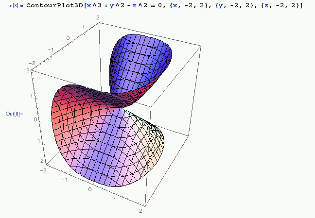

# Getting started with Mathematica

An introduction to using Mathematica on Raspberry Pi

## About Mathematica

Mathematica is a computational programming tool used in science, maths, computing, and engineering; it was first released in 1988. It is proprietary software that you can use for free on the Raspberry Pi, and it has been bundled with Raspbian and NOOBS since late 2013. Read the announcement on the Raspberry Pi blog: [The Wolfram Language and Mathematica on Raspberry Pi, for free](http://www.raspberrypi.org/the-wolfram-language-and-mathematica-on-raspberry-pi-for-free/).



If your SD card was updated since late 2013, then you should have Mathematica and Wolfram pre-installed and should see their icons on the Raspbian desktop:


You can also find the programs in your applications menu under *Education*.

## Installation

If the programs are not installed, please update your system by entering the following commands:

```bash
sudo apt-get update
sudo apt-get install wolfram-engine
```

Note this is a 200MB download, so it may take some time.

## Requirements

With Mathematica installed you should be able to follow along with the exercises.

The advanced worksheet features the use of some advanced mathematics (matrices). There is also one example of using GPIO, so for that you'll need basic input and outputs, such as a tactile button and an LED.

## Worksheets

- [Worksheet 1](worksheet1.md)
- [Worksheet 2](worksheet2.md) (advanced)

## Licence

Unless otherwise specified, everything in this repository is covered by the following licence:

[](http://creativecommons.org/licenses/by-sa/4.0/)

***Getting Started with Mathematica*** by the [Raspberry Pi Foundation](http://www.raspberrypi.org) is licenced under a [Creative Commons Attribution 4.0 International License](http://creativecommons.org/licenses/by-sa/4.0/).

Based on a work at https://github.com/raspberrypilearning/getting-started-with-mathematica
